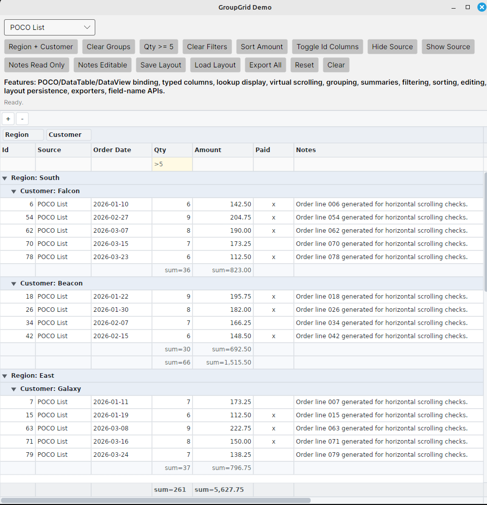

# Avalonia.Controls.Extras

Reusable Avalonia controls with no external dependencies.

The first control is `GroupGrid`, a general-purpose grid for data-entry and business applications. It is designed as a clean Avalonia control that can later be adapted by external frameworks, but the library itself remains framework-neutral.

## Documentation

- [GroupGrid Concepts](GroupGrid-Concepts.md)
- [Designing a Business Grid](1.Designing-a-Business-Grid.md)
- [Building a Business Grid Runtime](2.Building-a-Business-Grid-runtime.md)

## GroupGrid Features

Current implemented v1 feature map for `GroupGrid`.

### Architecture

- Avalonia `Control` with custom rendering.
- Separate non-visual `GroupGridEngine`.
- Framework-neutral core, with no Tripous dependency.
- Adapter-based data access through `IGroupGridDataAdapter`.
- Adapter notifications for reset, row add/remove/move/change, and cell change.
- Convenience `ItemsSource` support for POCO/list sources.
- `ItemsSource` support for `DataTable` and `DataView`; assigning a `DataTable` uses its `DefaultView`.
- Optional auto-generation of columns from public POCO properties.
- Optional auto-generation of columns from `DataView` data columns.
- Built-in list adapter for `IList<T>` sources.
- Built-in `DataView` adapter.
- List adapter listens to `INotifyCollectionChanged` and row-level `INotifyPropertyChanged` when available.
- `DataView` adapter listens to `ListChanged`.

### Columns

- Base `GroupGridColumn` descriptor.
- Specialized column types:
  - `GroupGridTextColumn`
  - `GroupGridNumberColumn`
  - `GroupGridDateColumn`
  - `GroupGridCheckBoxColumn`
  - `GroupGridLookupColumn`
- Column width and minimum width.
- Public best-fit column sizing APIs for one column, one column by name, or all visible value columns.
- Column visibility.
- Grid-level `AreIdColumnsVisible` policy for columns named `Id` or ending with `Id`, case-insensitively.
- Grid-level by-name APIs for column visibility and read-only state.
- Column display formatting.
- Date column edit formatting through `EditFormat`.
- Column horizontal text alignment.
- Lookup columns support separate `DisplayMember` and `ValueMember`.
- User flags for resize, reorder, grouping, and hiding.
- Query methods for all, visible ordered, hidden, and grouped columns.
- Per-column group and total summary aggregate settings.

### Layout

- Toolbar band.
- Group panel.
- Configurable empty group panel prompt through `EmptyGroupPanelText`.
- Column header band.
- Filter row band.
- Virtual body viewport.
- Footer total summary band.
- Vertical scrollbar.
- Horizontal scrollbar.
- Visibility properties for toolbar, group panel, column headers, filter panel, and totals summary bands.
- Public vertical viewport and horizontal offset setters.
- `ScrollToRow()` support for adapter rows present in the current projection.
- Current-cell scroll-into-view support.

### Theming

- Theme-facing Avalonia styled brush properties for:
  - grid body background
  - toolbar and toolbar buttons
  - group panel
  - column headers
  - filter row, filtered cells, and active filter cells
  - group rows and group summaries
  - selected, current, and editing cells
  - footer summaries
  - primary and muted text
  - scrollbars
  - column drag ghost
  - grid lines
  - current and editing borders
  - resize and drop guides

### Grouping

- Always root-node based projection.
- Group columns kept as an ordered list of column references.
- Group header rows.
- Group summary rows.
- Expand/collapse per group node.
- Collapsed groups show summary values in the group header.
- Header drag to group panel groups a column.
- Header drag outside the grid hides the column.
- Group panel drag supports grouped-column reorder.
- Grouped-column drag back to header band ungroups and inserts in column order.
- Grouped-column drag outside the grid removes it from grouping.

### Rows And Summaries

- Data rows.
- Group header rows.
- Group summary rows.
- Footer total summary row.
- Summary context menu for group and total summary aggregate selection.
- Summary aggregate kinds:
  - Count
  - Sum
  - Min
  - Max
  - Average

### Interaction

- Single current cell.
- Public current-row API with `CurrentRowIndex`, `CurrentRow`, and `CurrentRowChanged`.
- Single selected cell/row.
- Keyboard navigation.
- Mouse selection.
- Group expand/collapse by mouse.
- Column resize by dragging header edge.
- Column reorder by dragging headers.
- Floating header ghost while dragging columns.
- Drop insertion guide for column drag/drop.
- Column header context menu.
- Optional column manager context menu item.
- Default column manager dialog when no `ColumnManagerRequested` handler is attached.
- `GroupGridColumnManagerDialog` is a separate window that edits a serializable `GroupGridSettings` object.
- `GroupGridSettings` includes settings name, band visibility, default toolbar button visibility, sorting, and per-column order, width, visibility, grouping, filter, and summary settings.
- `CreateSettings()` and `ApplySettings()` provide in-memory layout snapshot and restore.
- `SaveSettings()` and `LoadSettings()` persist layout settings as JSON through a caller-provided full file path.
- Column header context menu can save and load settings through Avalonia file pickers.
- `IsSettingsMenuItemsVisible` controls the save/load settings context menu items.
- `SettingsSuggestedFileName` controls the default save-settings picker file name.
- Default column manager tabs cover visible/hidden columns, grouping, filters, and summaries.
- Vertical and horizontal scroll thumb dragging.
- Scrollbar track page scrolling.
- Drop-down editor geometry diagnostics through `LastEditorRect` and `LastDropDownRect`.
- Checkbox/boolean cell toggle by mouse click and `Space`.

### Toolbar

- Compact toolbar buttons rendered in the toolbar band.
- Built-in `Insert` and `Delete` buttons are visible by default.
- Built-in `Edit` button exists but is hidden by default.
- Insert creates an empty row after the current row when the source supports insertion.
- Delete removes the current row through cancellable row-operation events.
- The built-in delete button shows a small default confirmation dialog only when no `DeletingRow` handler is attached.
- Edit raises an event for the application to handle.
- Custom toolbar buttons can be added to the left group or aligned at the far right.
- Toolbar buttons support tooltip text.
- Toolbar API includes add and insert-before/insert-after helpers.
- Default toolbar button visibility properties are available for insert, delete, and edit.
- Custom toolbar button clicks raise `ToolButtonClicked`.

### Sorting And Filtering

- Engine-owned single-column sorting.
- Sorting cycles through none, ascending, descending, and back to none.
- Sort glyph displayed at the right edge of the sorted column header.
- Engine-owned per-column filter state.
- Filter row cells accept typed filter text.
- Filter text is applied when `Enter` is pressed.
- Plain filter text performs contains matching.
- Comparison filter operators:
  - `>`
  - `>=`
  - `<`
  - `<=`
  - `=`
  - `<>`
  - `!=`
- Wildcard filter matching with `%` or `*`.
- `Backspace` edits active filter text.
- `Delete` clears the active column filter.
- `Enter` applies active filter text.
- `Escape` cancels filter editing.
- Column context menu can clear a column filter or all filters.

### Export

- Exporter registry with built-in CSV, JSON, and HTML exporters.
- Exporters can be registered as instances or factories.
- `CreateExportSnapshot()` exposes visible columns, projected rows, raw values, display text, group rows, group summaries, and total summaries.
- `SaveExport()` writes an export through a selected exporter and caller-provided full file path.
- Column header context menu includes an `Export` submenu generated from the exporter registry.
- CSV export writes visible data rows with escaped cell text.
- JSON export writes formatted JSON with column metadata and data row values.
- HTML export writes a standalone HTML table with projected group rows, group summaries, and total summaries.

### Editing

- Edit state tracking.
- Begin edit.
- Commit edit.
- Cancel edit.
- In-place editor host with typed editor controls.
- Text in-place editor.
- Numeric in-place editor with right alignment and numeric validation.
- Numeric edits commit valid numbers and cancel invalid text back to the previous value.
- Date in-place editor with text input, `EditFormat`, and calendar drop-down.
- Date text normalization supports partial input such as day-only and day-month values.
- Lookup in-place editor with custom scrollable drop-down list.
- Boolean cells toggle directly by mouse click or `Space`.
- Custom in-place editors can be supplied through the grid-level `CreateInplaceEditor` event.
- Custom drop-down editors can derive from `GroupGridDropDownInplaceEditorBase`.
- Drop-down editors can use `IGroupGridDropDownEditorHost` to close, cancel, restore focus, or commit selected values without depending on `GroupGrid` internals.
- Drop-down editors support inline, popup, and auto popup placement through `DropDownPlacementMode`.
- Date normalization can be customized through the grid-level `DateNormalize` event.
- Inline editing uses `Enter` and `Tab` to commit and `Escape` to cancel.
- Control-level edit lifecycle events are available for validation, value mutation, commit handling, and cancel handling.
- Engine validation and commit events:
  - `BeginningEdit`
  - `CellValidating`
  - `CellValueCommitting`
  - `CellValueCommitted`
  - `EditCanceled`
- Row operation events:
  - `InsertingRow`
  - `RowInserted`
  - `DeletingRow`
  - `RowDeleted`

### Hit Testing

- Hit testing returns band/kind information.
- Cell hit results include direct `GroupGridColumn` references.
- Hit testing supports body cells, group expanders, headers, resize handles, group panel, footer summary, and scroll-aware coordinates.
- Hit testing maps hidden bands correctly when band visibility is disabled.

## GroupGrid V1 Status

`GroupGrid` v1 functionality is complete.

The repository includes:

- Unit tests for engine projection, filtering, sorting, grouping, summaries, editing, adapters, settings, exporters, and public control APIs.
- A `Demo00.GroupGrid` application covering list sources, `DataTable` / `DataView`, grouping, filters, summaries, editors, settings, export, and public API helpers.

## Hardening TODO

- Review in-place editor drop-down clipping near the bottom edge of the grid. Consider flip-up placement or moving only the drop-down host to a `Popup` / overlay layer.
- Consider Avalonia headless tests for visual editing lifecycle, editor positioning, and drop-down positioning.

## V2 Roadmap

- Typed filter descriptors beyond the current text-based column filters.

## License

Released under the MIT License.
See LICENSE for details.
